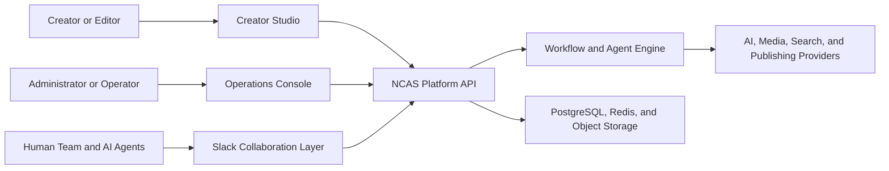

# NCAS Master Product Roadmap

**Status:** Product blueprint approved; implementation platform pending
**Last updated:** 2026-07-28
**Product:** NajeebCyber AI Studio (NCAS)

## 1. Product Vision

NCAS is an AI-powered cyber content creation studio and operations platform. It helps creators, educators, security teams, agencies, and brands plan, produce, approve, publish, and improve content about cybersecurity and cybercrime.

NCAS supports verified cyber news, threat intelligence, cybercrime awareness, ethical hacking education, security product marketing, thought leadership, courses, podcasts, newsletters, blogs, shorts, long-form video, infographics, and social campaigns.

The product uses a human-in-control operating model: agents research and produce structured work, while authorized people review high-risk claims, approve strategy, and control publishing.

## 2. Product Surfaces



### Creator Studio

The Creator Studio is the day-to-day workspace for strategy, planning, research, content production, review, publishing, and analytics.

### Operations Console

The Operations Console is a protected back-office control plane for agents, workflows, integrations, users, permissions, secrets, budgets, policies, monitoring, and advanced settings.

### Slack Collaboration Layer

Slack is the professional collaboration surface for people and agents. NCAS remains the system of record for content, approvals, source evidence, workflow state, assets, and analytics.

## 3. Core Operating Model

Every unit of work is persisted as a content job. A content job can represent a news alert, an educational video, a campaign post, a course lesson, a blog article, a podcast episode, or any other approved content item.

```text
DISCOVERED or REQUESTED
  -> STRATEGY_REVIEW
  -> PLANNED
  -> RESEARCHING
  -> FACT_CHECKING
  -> VERIFIED or REJECTED
  -> SCRIPT_DRAFT
  -> EDITOR_REVIEW
  -> VISUAL_PLAN
  -> ASSET_PRODUCTION
  -> RENDERING
  -> FINAL_REVIEW
  -> APPROVED_FOR_PUBLISHING
  -> SCHEDULED or PUBLISHED
  -> ANALYZED
```

Every state change records its initiator, timestamp, evidence, approval, cost, and outcome. The workflow engine enforces required review gates before publishing.

## 4. Chief Editor Experience

The Chief Editor is the strategic entry point for the platform. A user can submit a new niche, campaign, topic, or objective rather than only a breaking news story.

### User Inputs

- Niche or topic, such as AI security, cybercrime investigations, scam awareness, privacy, or ethical hacking.
- Goal, such as education, awareness, authority, audience growth, lead generation, training, or product marketing.
- Target audience, geography, languages, platforms, formats, publishing frequency, budget, and brand rules.
- Optional competitors, reference links, customer information, and existing content.

### Chief Editor Outputs

- Niche positioning and audience personas.
- Content pillars, topic clusters, and risk considerations.
- Seven-day, 30-day, or 90-day strategy and editorial calendar.
- Individual briefs, production plan, owner assignments, expected cost, and KPIs.
- Agent workflow and approval plan suitable for the selected content type.

## 5. Creator Studio Information Architecture

```text
Mission Control
Strategy Lab
Content Planner
Research Desk
Content Studio
Asset Library
Publishing Center
Analytics Lab
Knowledge Base
Brand Studio
```

### Mission Control

- Priority work, live job queue, pending approvals, active agent runs, render status, publishing status, and risks.
- Daily output target, campaign progress, recent activity, and Slack discussion links.
- Filters by workspace, campaign, content type, owner, priority, and status.

### Strategy Lab

- New-niche and campaign intake forms.
- Chief Editor strategy proposal with editable audience, pillars, formats, budget, and KPIs.
- Version comparison, manual editing, approval, and Slack review actions.

### Content Planner

- Day, week, and month calendar views.
- Kanban workflow view: idea, research, draft, review, production, approved, scheduled, and published.
- Recurring series, capacity planning, assignments, deadlines, and drag-and-drop scheduling.

### Research Desk

- Source feed, research notes, source snapshots, claim-evidence matrices, and conflict warnings.
- Filters by source type, authority, topic, CVE/advisory, region, and verification status.
- Direct links from claims to source evidence and fact-check outcomes.

### Content Studio

Each content item provides these tabs:

```text
Overview | Brief | Research | Fact Check | Script | Visual Plan
Assets | Production | Publishing | Analytics | Comments | Version History
```

- Rich editing for scripts, articles, newsletters, course modules, and social copy.
- Reading-speed, duration, platform-limit, language, and citation validation.
- Scene storyboards, visual prompts, caption plans, voice direction, and media review.
- Comments, assignments, approvals, rejection reasons, and complete version history.

### Brand Studio and Asset Library

- Brand palette, logos, fonts, tone, disclaimers, templates, avatar rules, lower thirds, intros, and outros.
- Searchable media library for source files, generated images, video, audio, captions, thumbnails, and final renders.
- Asset provenance, prompt/provider metadata, dimensions, duration, rights, licensing, approval status, and reuse controls.

### Publishing Center and Analytics Lab

- Platform-specific previews, captions, titles, hashtags, thumbnails, subtitles, schedule, and privacy controls.
- Explicit approve, schedule, publish, pause, cancel, and retry actions.
- Metrics for views, retention, CTR, engagement, follows, conversions, and campaign performance.
- Evidence-based recommendations that require human acceptance before altering content strategy.

## 6. Operations Console Information Architecture

```text
System Overview
Organizations and Workspaces
User Access
Agent Control Center
Workflow Builder
Prompts and Knowledge
Providers and APIs
Slack Operations
Publishing Connections
Media and Render Control
Storage and Retention
Security and Audit
Budgets and Usage
Monitoring and Logs
Feature Flags
Advanced Settings
```

### System Overview

- Active users, workspaces, campaigns, content jobs, agent health, queue depth, provider health, render capacity, storage usage, publication success, cost, and security alerts.

### Agent Control Center

Each agent has a configuration and observability page with:

- Enable or disable state and allowed workspaces, niches, formats, and languages.
- Provider/model choice, fallback, parameters, prompt version, knowledge access, cost limit, timeout, retries, and escalation owner.
- Required input/output schema, confidence threshold, quality checks, tools, and permissions.
- Slack channel/thread mapping, notification level, and report schedule.
- Run history, heartbeat, current work, costs, latency, errors, outputs, and human feedback.

### Workflow Builder

- Visual workflow canvas using versioned templates for news, educational content, campaigns, podcasts, courses, blogs, and other formats.
- Agent stages, human approvals, conditional branches, quality gates, retry paths, deadlines, assignments, and escalation policies.
- Sandbox testing and controlled activation/rollback of workflow versions.

### Prompts, Knowledge, and Brand Governance

- Versioned prompt library by agent, format, language, and provider.
- Prompt test sandbox and output comparison.
- Access-controlled editorial policy, source standards, brand standards, subject knowledge, and reusable content assets.
- Knowledge expiry, conflict, and review workflows.

### Providers, APIs, and Publishing Connections

- Managed configuration for text, image, video, voice, transcription, translation, research, Slack, n8n, and social platforms.
- Secure OAuth/API-key setup, masked credentials, connection tests, scopes, quota, rate limits, usage, errors, fallback rules, and secret-expiry alerts.
- No full secret is displayed after saving; secrets are encrypted server-side.

### Security, Budgets, and Monitoring

- Role management, MFA, audit logs, publishing approvals, security incident mode, export/deletion controls, and integration pause controls.
- Cost budgets by organization, workspace, campaign, agent, provider, and user.
- Logs, traces, errors, failed webhooks, queue retries, alert routing, backup status, and environment-specific feature flags.

## 7. Agent Model

All agents implement a consistent lifecycle:

```text
validate(input) -> execute(input) -> quality_check(result) -> report(result)
                                      -> rollback_or_retry(error)
```

### Strategy and Knowledge Agents

1. Chief Editor: strategy, prioritization, workflow orchestration, and escalation.
2. Niche Strategist: positioning, audience research, content gaps, and competitors.
3. Campaign Planner: calendars, content briefs, deadlines, and capacity planning.
4. Knowledge Manager: editorial, brand, cybersecurity, and reusable-content knowledge.

### Research and Editorial Agents

5. Research Agent: authoritative and editorial source collection.
6. Cyber Threat Analyst: advisories, CVEs, exploit status, and security context.
7. Cybercrime Researcher: scams, fraud, investigations, prevention, and public safety.
8. Fact Check Agent: evidence, confidence, conflicts, and verification decisions.
9. Script Agent: scripts, articles, newsletters, social copy, and course material.
10. SEO and Distribution Agent: platform adaptation and discoverability.

### Creative Production Agents

11. Creative Director: narrative angle, format, and visual direction.
12. Image Director: provider routing, prompt generation, and visual quality control.
13. Thumbnail Intelligence: thumbnail concepts, variants, and CTR hypotheses.
14. Video Director: scene plan and video-generation direction.
15. Voice and Audio Director: voiceover, pacing, music, and accessibility direction.
16. Motion Graphics Agent: overlays, captions, lower thirds, and template application.
17. Render Agent: asset validation, rendering, and media QA.

### Operations and Growth Agents

18. Brand Guardian: brand, accessibility, copyright, and style checks.
19. Approval Manager: review routing, deadline reminders, and escalation.
20. Publisher: approved scheduling and platform delivery.
21. Analytics Agent: performance reporting and recommendations.
22. Community Agent: safe response drafts and recurring-question insights.

Agents have least-privilege permissions. No agent can approve and publish its own high-risk content.

## 8. Slack Operating Model

NCAS is the system of record. Slack is the professional team room.

### Standard Channels

```text
#ncas-command-center
#ncas-content-planning
#ncas-research-desk
#ncas-fact-check
#ncas-script-room
#ncas-visual-studio
#ncas-production
#ncas-publishing
#ncas-analytics
#ncas-brand-governance
#ncas-agent-ops
#ncas-security-operations
```

Private channels are required for clients, unpublished incidents, sensitive investigations, and internal strategy.

### Slack Features

- One structured thread per campaign, content item, or approval cycle.
- Slash commands: `/ncas new-niche`, `/ncas plan`, `/ncas brief`, `/ncas status`, `/ncas approve`, and `/ncas pause`.
- Interactive buttons for approve, request changes, escalate, pause, and open in NCAS.
- Modals for intake, review, feedback, corrections, and assignments.
- App Home with assigned work, pending approvals, current campaign status, and agent activity.
- Scheduled daily briefings, weekly analytics reports, deadline reminders, and incident escalations.
- Deep links to exact NCAS content, evidence, approval, asset, and workflow pages.

Agents must not post secrets, raw personally identifiable information, private evidence, or unsupported claims to Slack.

## 9. Technical Architecture

```text
Next.js Web Applications
  -> FastAPI API Gateway
    -> PostgreSQL
    -> Redis
    -> MinIO or S3 Storage
    -> Worker Queue
      -> Agent Workers
      -> Research Workers
      -> Media Workers
      -> Render Workers
      -> Publishing Workers
    -> Slack and Provider Webhooks
```

### Recommended Stack

- Frontend: Next.js, React, TypeScript, Tailwind CSS, shadcn/ui, TanStack Query, React Hook Form, Zod, Framer Motion, React Flow, TipTap.
- Backend: Python, FastAPI, SQLAlchemy 2, Alembic, Pydantic 2, Celery or a comparable worker system.
- Data: PostgreSQL, Redis, MinIO locally and S3-compatible storage in production.
- Infrastructure: Docker Compose locally; container deployment with managed database, cache, storage, and monitoring in production.
- Integrations: adapter interfaces for text, image, video, voice, search, Slack, analytics, and publishing providers.

### Initial Data Model

```text
users, roles, sessions, organizations, workspaces, brand_profiles
campaigns, content_plans, content_items, content_versions
sources, source_snapshots, claims, fact_checks, research_runs
agent_runs, workflows, workflow_versions, approvals, comments, audit_events
prompts, prompt_versions, knowledge_documents, knowledge_chunks
assets, renders, captions, thumbnails, publishing_jobs, platform_posts
analytics_snapshots, experiments, provider_connections, usage_records
```

## 10. Roles and Governance

- Platform Owner: platform settings, environments, billing, and secrets.
- Organization Admin: workspaces, users, integrations, and workflows.
- Editor-in-Chief: strategy, editorial approvals, and policy overrides.
- Researcher and Fact Checker: sources, evidence, and verification only.
- Creative Director and Producer: visual plans, assets, and production.
- Publisher: approved scheduling and publishing only.
- Analyst: analytics and reporting.
- Client/Reviewer: assigned reviews and comments only.
- Agent service identity: scoped machine permissions only.

For sensitive material, separate the author, approver, and publisher roles.

## 11. Trust, Safety, and Work Ethics

- Every factual claim stores source evidence and verification status.
- Agents must not fabricate sources, citations, CVEs, threat attribution, incidents, or metrics.
- Uncertain information must be labelled as reported, unverified, or under investigation.
- High-risk content requires independent fact-check and Editor-in-Chief approval.
- Publishing requires explicit human approval; systems may prepare drafts and uploads but must not make uncontrolled public posts.
- Asset rights, licenses, prompts, provider/model metadata, and approvals are recorded.
- Human decisions override agent recommendations.
- Audit logs record inputs, outputs, model/provider, cost, actor, approval, and publication status.

## 12. Delivery Roadmap

### Phase 0: Product Blueprint

- [ ] Complete PRD, user personas, feature scope, and success metrics.
- [ ] UX sitemap, low-fidelity wireframes, and shared design system.
- [ ] System architecture, data model, API contracts, and security threat model.
- [ ] Editorial policy, brand guide, fact-checking policy, and agent operations policy.
- [ ] Slack operating model, source policy, media-rights policy, and delivery acceptance criteria.

### Phase 1: Platform Foundation

- [ ] Establish monorepo with `apps/dashboard`, `apps/api`, shared packages, tests, documentation, and CI.
- [ ] Add Docker Compose, PostgreSQL, Redis, MinIO, environment validation, logging, and error tracking.
- [ ] Build authentication, organizations, workspaces, RBAC, audit logs, and design-system shell.
- [ ] Implement health checks, database migrations, backups, and basic Operations Console access.

### Phase 2: Strategy and Content Management

- [ ] Build workspace, brand, niche, campaign, content-plan, and content-brief models.
- [ ] Implement Chief Editor strategy workflow and 30-day planner.
- [ ] Build Mission Control, calendar, Kanban, Content Studio shell, comments, and version history.
- [ ] Add first Slack integration for intake, notifications, threads, and deep links.

### Phase 3: Research and Trust

- [ ] Integrate official advisory, CVE, vendor, and vetted editorial sources.
- [ ] Build research desk, source snapshots, claim-evidence records, and fact-check workflow.
- [ ] Add prompt/knowledge management and agent configuration controls.
- [ ] Require verified sources and human approval for high-risk content.

### Phase 4: Creative Production

- [ ] Build scripts, articles, newsletters, and social package generation.
- [ ] Add visual storyboards, image-provider routing, thumbnails, voice, captions, and asset library.
- [ ] Create brand templates and Brand Guardian checks.
- [ ] Implement real job-specific FFmpeg rendering and output validation.

### Phase 5: Publishing and Analytics

- [ ] Connect private/unlisted YouTube upload with approvals and audit trail.
- [ ] Add TikTok, Instagram, LinkedIn, and X one integration at a time.
- [ ] Ingest analytics, provide campaign reports, and support controlled experiments.
- [ ] Build publishing controls, platform previews, retries, and scheduling.

### Phase 6: Operations Maturity

- [ ] Complete Agent Control Center, Workflow Builder, provider controls, and Slack Operations Console.
- [ ] Add budget controls, monitoring, alerting, incident mode, storage retention, exports, and feature flags.
- [ ] Establish staging/production deployment, load tests, security tests, backup recovery tests, and operational runbooks.

## 13. First Vertical Slice

The first production-quality workflow must be:

```text
Create Workspace
  -> Configure Brand
  -> Submit New Niche
  -> Chief Editor Generates a 30-Day Plan
  -> Human Approves Strategy
  -> Create a Content Brief
  -> Research and Fact Check
  -> Draft Script
  -> Editor Approves
  -> Display Real Status in Creator Studio and Slack
```

This establishes the professional core: strategy, collaboration, source evidence, human approval, traceable work, and operational visibility. Media generation and publishing are added afterward on this trusted foundation.
