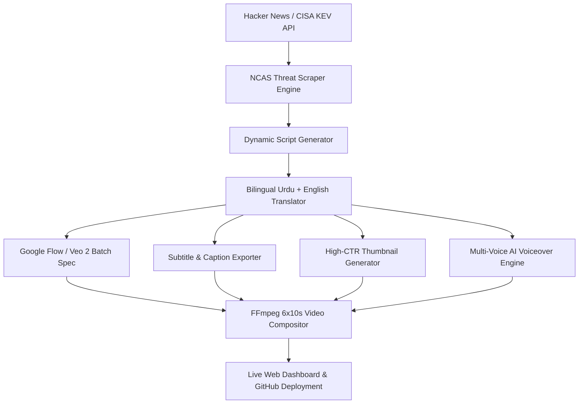

# 🛡️ NajeebCyber AI Studio (NCAS) - Master Product Roadmap & Architecture

**Project Handle:** `@NajeebCyber` (YouTube Shorts, TikTok, Instagram Reels, LinkedIn, X, Facebook)  
**Local Workspace:** `e:\NCAS`  
**Web Command Center:** `http://localhost:786`  
**GitHub Repository:** [https://github.com/najeebulhussan/NCAS](https://github.com/najeebulhussan/NCAS)  
**Last Updated:** July 2026

---

## 🚀 Executive Summary

**NajeebCyber AI Studio (NCAS)** is an autonomous, end-to-end AI-powered cybersecurity news production studio and media network. It automates 100% of the broadcast lifecycle—from real-time threat scraping (Hacker News, CISA KEV, NIST NVD) to dynamic script copywriting, bilingual Urdu & English teleprompter translation, `.SRT` caption exporting, 3D Midjourney/DALL-E thumbnail generation, video compositing, and GitHub deployment.



---

## 🏆 Completed Milestones & Accomplished Roadmap

### ✅ Phase 1: Infrastructure & Repository Initialization
- [x] Initialized Git repository `e:\NCAS` with remote `https://github.com/najeebulhussan/NCAS.git`.
- [x] Configured `.gitignore`, `package.json`, and npm script command shortcuts.
- [x] Built live Chat Sync Engine (`scripts/fetch_chat_updates.js`) to continuously sync shared ChatGPT resources.

### ✅ Phase 2: AI Subagent Architecture & Master Prompts
- [x] Defined 12 AI Subagents Architecture Topology ([docs/architecture.md](file:///e:/NCAS/docs/architecture.md)).
- [x] Formatted 20 Short Video Broadcast Formats ([docs/branding.md](file:///e:/NCAS/docs/branding.md)).
- [x] Authored Master OmniFlash Prompt v2.1 ([prompts/master_omniflash_prompt.md](file:///e:/NCAS/prompts/master_omniflash_prompt.md)).

### ✅ Phase 3: Interactive Web Command Center (`http://localhost:786`)
- [x] Dark cyber neon glassmorphic studio dashboard built with HTML5, CSS3, and JavaScript.
- [x] 60-Second Vertical (9:16) Teleprompter & Live Telecast Simulator.
- [x] Live 12 AI Subagents Swarm Monitor.
- [x] Live Cybersecurity News Feed connected to Hacker News Algolia API.
- [x] Canvas-based SOC Threat Radar Simulation.

### ✅ Phase 4: Automated Broadcast CLI Engines
- [x] **1-Click Broadcast Pipeline** (`npm run build-broadcast`): Generates scripts, render configs, and social metadata.
- [x] **Google Flow Batch Exporter** (`npm run export-flow`): Formats JSON render specs for Google Veo 2 / Flow.
- [x] **Bilingual Script Translator** (`npm run translate`): Generates side-by-side Urdu (`اردو`) & English packages.

### ✅ Phase 5: Advanced Media Engines & Complete GUI Hub
- [x] **Subtitle & Caption Exporter** (`npm run export-subtitles`): Exports `.srt` and `.vtt` caption tracks for English and Urdu.
- [x] **High-CTR Thumbnail Spec Generator** (`npm run generate-thumbnail`): Generates 3D Midjourney v6 & DALL-E 3 visual cover prompts.
- [x] **FFmpeg Video Compositor** (`npm run composite-video`): Merges scene clips, audio tracks, and hardburned subtitles.
- [x] **CISA & NIST CVE Watchdog Daemon** (`npm run watchdog`): 24/7 background zero-day threat scanner with automatic script triggers.
- [x] **Customizable Clip Time Slots**: Supports dynamic scene clip durations (`10s, 15s, 8s, 12s, 15s`) and custom total lengths (`30s, 60s, 90s`).
- [x] **Dedicated CISA CVE Watchdog Tab (Tab 6)**: Visual dashboard for active zero-days with 1-click script generators.
- [x] **Complete GUI Modals Hub**: Full graphical interface modals for Subtitles, Thumbnails, FFmpeg Compositor, and Master Pipeline execution.

---

## 🔮 Future Expansion Roadmap (Phases 6 - 8)

### 📌 Phase 6: Multi-Cloud TTS & Native Video Compositing (Q3 2026)
- [ ] **ElevenLabs & OpenAI Audio API Direct Integration**: Direct MP3 audio file generation for voiceovers.
- [ ] **Background Ambient Music Library**: Pre-cleared 60s cyber synthwave music tracks integrated into compositing pipeline.
- [ ] **Automated FFmpeg Binary Installer (`scripts/install_ffmpeg.js`)**: Auto-detects and installs portable FFmpeg binary if missing in system PATH.

### 📌 Phase 7: 1-Click Multi-Platform Social Publisher (Q4 2026)
- [ ] **YouTube Data API v3 Upload Engine**: 1-click scheduling to YouTube Shorts under `@NajeebCyber`.
- [ ] **TikTok Content Posting API Engine**: Direct video posting to TikTok account.
- [ ] **Instagram Graph API Engine**: Direct posting to Instagram Reels.
- [ ] **X & LinkedIn API Publisher**: Automated text + video posting for professional audiences.

### 📌 Phase 8: 24/7 Autonomous Newsroom Loop & Retention Analytics (Q1 2027)
- [ ] **24/7 Cron Daemon (`scripts/daemon_loop.js`)**: Fully autonomous hourly execution of threat scraping, script generation, rendering, and posting.
- [ ] **Retention Analytics Dashboard**: Tracks view counts, watch time, and engagement metrics inside Web Studio UI.

---

## 🛠️ Complete CLI Command Reference

| Command | Action | Description |
|---------|--------|-------------|
| `npm start` | **Serve Web Dashboard** | Starts local studio dashboard on `http://localhost:786` |
| `npm run update-chat` | **Sync ChatGPT Chat** | Scrapes shared link & auto-pushes updates to GitHub |
| `npm run generate-script` | **Generate Script** | Constructs dynamic broadcast scripts for custom topics |
| `npm run export-flow` | **Export Flow Spec** | Exports batch render config for Google Flow / Veo 2 |
| `npm run build-broadcast` | **1-Click Pipeline** | End-to-end generation of scripts, configs, and social copy |
| `npm run translate` | **Translate Script** | Translates teleprompter script to Urdu (`اردو`) & English |
| `npm run export-subtitles` | **Export Subtitles** | Generates `.srt` & `.vtt` subtitle files |
| `npm run generate-thumbnail` | **Generate Thumbnail** | Generates 3D Midjourney/DALL-E high-CTR thumbnail prompts |
| `npm run composite-video` | **FFmpeg Compositor** | Builds video clip concatenation & audio mix render specs |
| `npm run watchdog` | **CISA Threat Watchdog** | Scrapes CISA KEV catalog for zero-days & triggers auto-scripts |
| `npm run generate-voiceover`| **Generate Voiceover** | Generates English & Urdu TTS voiceover specs |
| `node scripts/run_all_studio.js` | **Master 8-Step Run** | Executes complete end-to-end studio pipeline & pushes to GitHub |

---

## 📁 Repository Structure Overview

```text
NCAS/
├── .gitignore
├── README.md
├── package.json
├── docs/
│   ├── prd.md
│   ├── architecture.md
│   ├── branding.md
│   └── ncas_master_roadmap.md
├── prompts/
│   ├── master_omniflash_prompt.md
│   └── weekly_cyber_news_avatar_prompt.md
├── resources/
│   ├── chat_history/
│   └── cisa_kev_cache.json
├── scripts/
│   ├── fetch_chat_updates.js
│   ├── generate_news_script.js
│   ├── export_flow_config.js
│   ├── render_pipeline.js
│   ├── translate_script.js
│   ├── export_subtitles.js
│   ├── generate_thumbnail_spec.js
│   ├── composite_video.js
│   ├── cisa_watchdog.js
│   ├── generate_voiceover.js
│   └── run_all_studio.js
├── src/
│   ├── index.html
│   ├── styles.css
│   └── app.js
└── output/
    ├── scripts/
    ├── flow_configs/
    ├── social/
    ├── translations/
    ├── subtitles/
    ├── thumbnails/
    ├── renders/
    ├── threat_alerts/
    └── audio/
```
